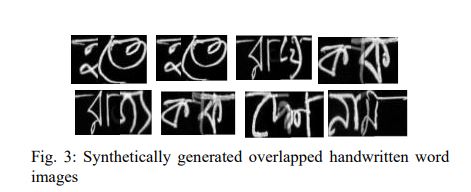
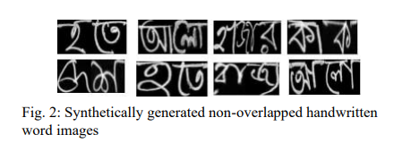

# Handwritten-Word-Recognition

Dataset can be found here: https://www.kaggle.com/competitions/bengaliai-cv19

**Title: Handwritten Word Recognition using Deep Learning Approach: A Novel Way of Generating Handwritten Words**

**Abstract**

A handwritten word recognition system comes with issues such as– lack of large and diverse datasets. It is necessary to resolve such issues since millions of official documents can
be digitized by training deep learning models using a large and diverse dataset. Due to the lack of data availability, the
trained model does not give the expected result. Thus, it has
a high chance of showing poor results. This paper proposes a
novel way of generating diverse handwritten word images using
handwritten characters. The idea of our project is to train the
BiLSTM-CTC architecture with generated synthetic handwritten
words. The whole approach shows the process of generating two
types of large and diverse handwritten word datasets: overlapped
and non-overlapped. Since handwritten words also have issues
like overlapping between two characters, we have tried to put
it into our experimental part. We have also demonstrated the
process of recognizing handwritten documents using the deep
learning model. For the experiments, we have targeted the Bangla
language, which lacks the handwritten word dataset, and can be
followed for any language. Our approach is less complex and less
costly than traditional GAN models. Finally, we have evaluated
our model using Word Error Rate (WER), accuracy, f1-score,
precision, and recall metrics. The model gives 39% WER score,
92% percent accuracy, and 92% percent f1 scores using nonoverlapped data and 63% percent WER score, 83% percent
accuracy, and 85% percent f1 scores using overlapped data

**Architecture**

 

**Generated dataset sample**

 

  

**Paper Link**
https://ieeexplore.ieee.org/abstract/document/10021025

**PDF Copy**
https://arxiv.org/ftp/arxiv/papers/2303/2303.07514.pdf

**My Google scholar**
https://scholar.google.com/citations?view_op=list_works&hl=en&hl=en&user=PHg000cAAAAJ

  **Cite Work**

  Bibtex:  
  
  @inproceedings{akter2022handwritten,
  title={Handwritten word recognition using deep learning approach: A novel way of generating handwritten words},
  author={Akter, Mst Shapna and Shahriar, Hossain and Cuzzocrea, Alfredo and Ahmed, Nova and Leung, Carson},
  booktitle={2022 IEEE International Conference on Big Data (Big Data)},
  pages={5414--5423},
  year={2022},
  organization={IEEE}
}

MLA:

Akter, Mst Shapna, et al. "Handwritten word recognition using deep learning approach: A novel way of generating handwritten words." 2022 IEEE International Conference on Big Data (Big Data). IEEE, 2022.

APA:

Akter, M. S., Shahriar, H., Cuzzocrea, A., Ahmed, N., & Leung, C. (2022, December). Handwritten word recognition using deep learning approach: A novel way of generating handwritten words. In 2022 IEEE International Conference on Big Data (Big Data) (pp. 5414-5423). IEEE.

